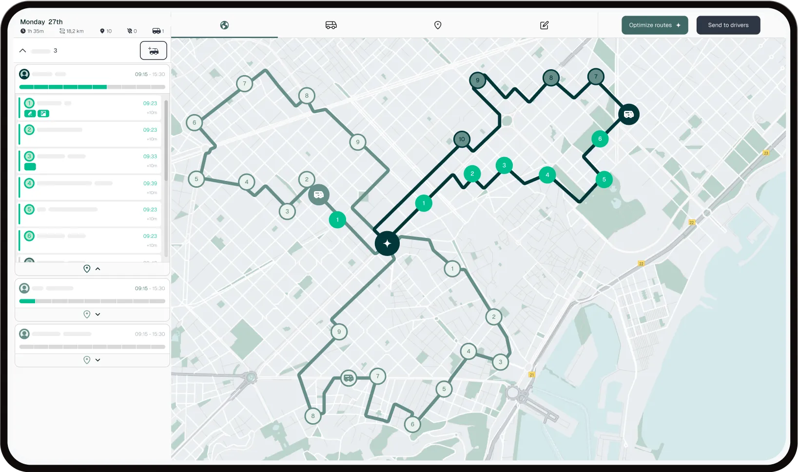
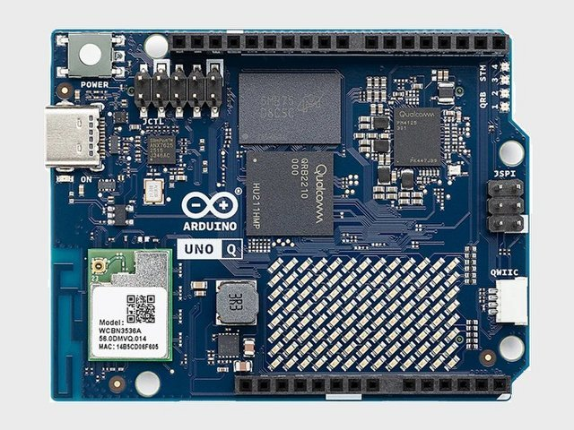
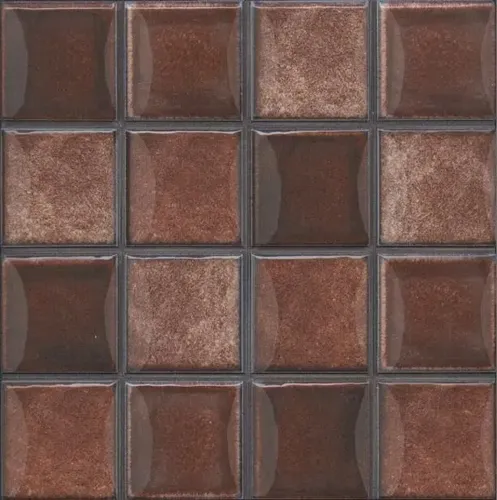
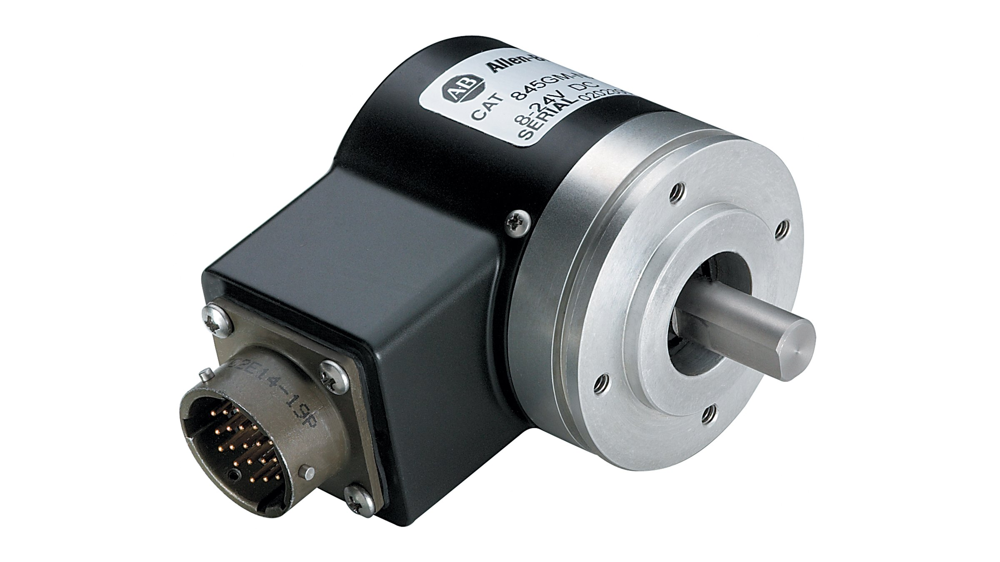

# 😀 Mapeo de zona--movimiento

# Robot Autónomo — Documentación del Proyecto

## Objetivo del proyecto

El objetivo del proyecto es diseñar y construir un robot autónomo capaz de desplazarse dentro de una maqueta de aproximadamente 3 × 3 metros, navegando desde un punto de inicio hasta un destino específico. El robot deberá utilizar un mapa predefinido del entorno, detectar obstáculos inesperados colocados durante la prueba, esquivarlos y reincorporarse a la ruta originalmente planificada.

---

## Filosofía de diseño

Se determinó que la principal dificultad del proyecto no radica en el mapeo del entorno, sino en lograr un movimiento preciso, una localización adecuada y una capacidad confiable de evasión de obstáculos. Por esta razón, se descartó el uso de técnicas complejas como SLAM (Simultaneous Localization and Mapping) y se optó por una solución más simple, robusta y adecuada al nivel del proyecto.

---

## Microcontrolador seleccionado

Se decidió utilizar el **Arduino UNO Q , debido a que dispone de más memoria que el Arduino Uno tradicional y es compatible con Arduino App Lab, entorno de programación que ya se encuentra disponible para el desarrollo del proyecto.

---

## Entorno de programación

El desarrollo del software se realizará utilizando **Arduino App Lab**. Para la visualización de información durante las pruebas se utilizará el monitor integrado mediante los comandos `Monitor.print()` y `Monitor.println()`.

---

## Representación del entorno

El entorno se representará mediante una **matriz de ocupación de 20 × 20 celdas**. Cada celda corresponde a una pequeña porción del espacio físico de la maqueta. Esta representación permite almacenar obstáculos, definir posiciones y calcular rutas de manera sencilla, además de facilitar modificaciones rápidas el día de la prueba.

Para las primeras pruebas se utilizó un mapa compuesto por:

- Obstáculos en todos los bordes de la matriz.
- Un obstáculo fijo central de 5 × 5 celdas.

---

## Sistema de coordenadas

Se adoptó un sistema de coordenadas cartesianas del tipo `(x, y)`, donde:

- `x` se moverá entre el plano horizontal.
- `y` se moverá entre el plano vertical .

Para las pruebas iniciales se definieron:

- **Punto de inicio:** `(1, 1)`
- **Punto de destino:** `(11, 14)`

---

## Planificación de rutas

Se estudiaron dos algoritmos de búsqueda: **BFS** (Breadth-First Search) y **A\***.

Finalmente se seleccionó **BFS** debido a que:

- Garantiza encontrar la ruta más corta.
- Es sencillo de implementar.
- Es fácil de explicar y defender académicamente.
- Resulta completamente adecuado para una matriz de 20 × 20 celdas.

El movimiento permitido dentro de la matriz se limitó a cuatro direcciones:

- Arriba
- Abajo
- Izquierda
- Derecha

Esta restricción representa de manera más realista el comportamiento de un robot diferencial de dos ruedas.

---

## Simulación virtual desarrollada

Durante esta etapa se logró implementar exitosamente:

- La creación automática de la matriz de ocupación.
- La definición de obstáculos fijos.
- La ejecución del algoritmo BFS.
- La reconstrucción de la ruta calculada.
- La simulación virtual del movimiento.
- La impresión de las coordenadas recorridas en tiempo real mediante el monitor de Arduino App Lab.

Esta simulación permitió verificar que el algoritmo era capaz de encontrar rutas válidas y evitar correctamente los obstáculos definidos dentro del mapa.

---

## Manejo de obstáculos dinámicos

Una vez implementada la navegación básica, se plantea que el robot sea capaz de reaccionar ante obstáculos inesperados colocados durante la prueba.

La estrategia propuesta consiste en:

1. Detectar el obstáculo.
2. Detener el movimiento.
3. Calcular una nueva ruta local para rodearlo.
4. Superar el obstáculo.
5. Regresar a la ruta originalmente planificada hacia el destino final.

---

## Relación entre el mundo virtual y el mundo físico

Se estableció que cada celda de la matriz representará una distancia física determinada. Como ejemplo inicial se consideró una equivalencia aproximada de **15 cm por celda**.

De esta manera, un desplazamiento virtual entre dos celdas consecutivas podrá traducirse posteriormente en una distancia real que el robot deberá recorrer físicamente.

---

## Sistema de movimiento físico

Se concluyó que el uso de **encoders** es prácticamente indispensable para lograr una navegación precisa.

- **Sin encoder:** el robot solo podría desplazarse en función del tiempo, lo que genera errores debido a variaciones en la batería, la fricción del piso y las diferencias entre motores.
- **Con encoder:** el robot podrá conocer exactamente cuánto ha avanzado, permitiendo traducir cada movimiento de la matriz en desplazamientos físicos repetibles y precisos.

---

## Estrategia de desarrollo del proyecto

El desarrollo se dividió en varias etapas:

### Etapa 1 — Simulación virtual ✅ *Completada*
- Construcción de la matriz.
- Implementación de BFS.
- Obtención de rutas virtuales.

### Etapa 2 — Pruebas físicas básicas
- Control de motores mediante PWM.
- Verificación del funcionamiento del driver.

### Etapa 3 — Motor con encoder
- Conteo de pulsos.
- Relación entre pulsos y distancia recorrida.
- Control preciso del desplazamiento.

### Etapa 4 — Dos motores con encoder
- Movimiento en línea recta.
- Corrección de diferencias entre motores.
- Ejecución de giros de 90 grados.

### Etapa 5 — Ejecución física de rutas
- Conversión de la ruta calculada por BFS en movimientos reales.

### Etapa 6 — Obstáculos dinámicos
- Integración de sensores.
- Detección de obstáculos inesperados.
- Replanificación local de la trayectoria.
- Continuación de la misión.

---

## Selección de motores

Se analizaron dos alternativas principales:

| Opción | Motor | Ventajas | Desventajas |
|--------|-------|----------|-------------|
| Alternativa 1 | Motores TT con encoder | Bajo costo | Menor precisión, mayor holgura mecánica |
| Alternativa 2 ✅ | Motores metálicos N20 con encoder integrado | Mayor precisión, tamaño compacto, buen desempeño en robots ligeros | Mayor costo |

Las características recomendadas para los motores N20 son:

- **Voltaje de operación:** 6 V
- **Relación de engranajes:** aprox. 1:50
- **Encoder:** en cuadratura integrado
- **Ruedas:** entre 65 y 80 mm de diámetro

---

## Estado actual del proyecto

Actualmente se encuentra completamente desarrollada la **etapa de simulación virtual**. El sistema es capaz de representar el entorno, calcular rutas óptimas mediante BFS y simular el desplazamiento del robot evitando obstáculos fijos.

El siguiente paso consiste en iniciar las **pruebas físicas con motores y encoders**, con el objetivo de conectar el modelo virtual desarrollado con el movimiento real del robot.

En términos generales, ya se ha resuelto la parte conceptual más compleja del proyecto: representar el entorno, planificar trayectorias y traducir dichas trayectorias en una secuencia de movimientos ejecutables por un robot físico. El trabajo restante corresponde principalmente a la **integración y ajuste del hardware** para reproducir en el mundo real el comportamiento validado mediante simulación.
